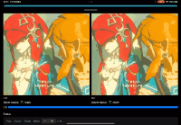

# SyncPlayer

[](https://cocoapods.org/pods/SyncPlayer)

</img>

## 简介
支持同时播放任意多个播放源的 iOS 协同播放器。

可以任意设置单条视频源的偏移 (offset) ，节选 (selection) 。

目前已支持iOS系统播放器 `AVPlayer` 、Netless白板回放 `WhiteReplayer` 。

支持自定义视频播放器的接入，只需遵循 `AtomPlayer` 协议 。

## 安装
cocoapods

```ruby
pod 'SyncPlayer'
```

## 使用方式
请在 example 中查看

## 注意
offset 和 selection 每个视频源建议只操作一次。

对同一视频多次操作的情况暂不在考虑内。

offset只能为正数